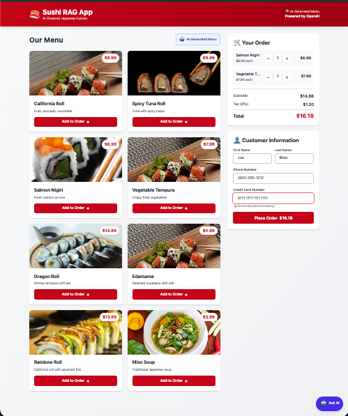
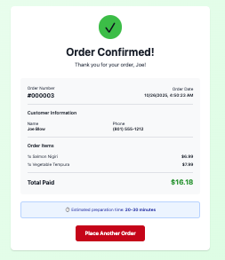
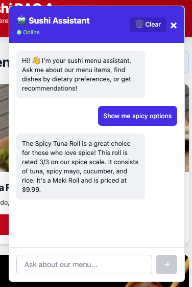
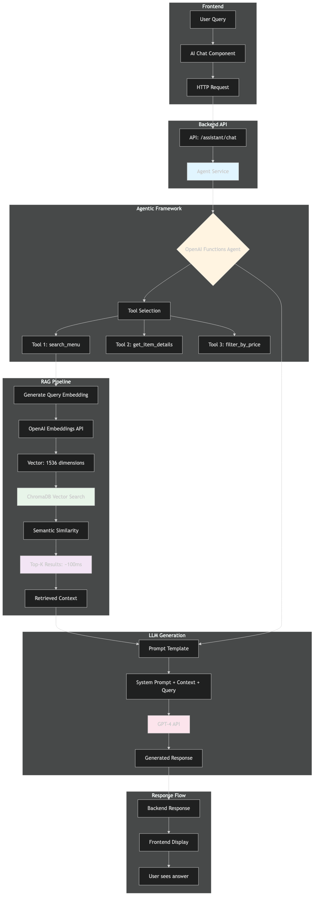
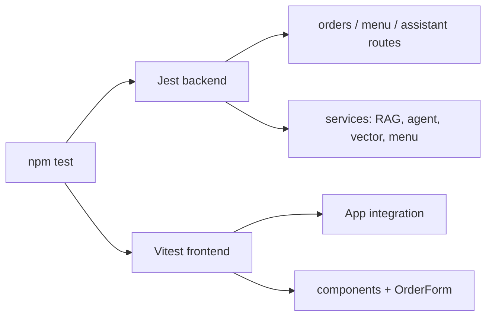

# Sushi RAG App 🍣

A modern food ordering web application with AI-powered menu assistance, featuring React frontend, Node.js backend, and PostgreSQL database.

## Features

- 🍱 Browse sushi menu with beautiful UI
- 🛒 Add items to cart
- 📦 Place orders
- 💾 **Session storage** - customer information retained across orders for quick reordering
- ✨ **Advanced form validation** - onBlur field-level error checking with real-time visual feedback
- 🤖 **AI-powered chat assistant** with RAG and a multi-tool LangChain agent
- 🔍 **Semantic search** - find items by description, ingredients, dietary preferences
- 🧠 **Multi-tool AI agent** - autonomous tool selection for complex queries (price filter, semantic search, item details)
- 🎯 **Deterministic answers for constrained queries** - RAG path parses price/category/spice from natural language and returns a consistent, sorted list when constraints apply (parity with debug tooling)
- 💬 **Conversational interface** - natural language menu recommendations
- 🗄️ **Vector database** - ChromaDB for semantic similarity search
- 🐳 Docker-based development environment
- ✅ Automatic Docker health checks (with retries while containers become healthy)
- 🧹 **`cleanup:docker` / `dev:clean`** - avoids stale container name conflicts before `docker-compose up`
- 🧪 **Test coverage thresholds** - backend (Jest) and frontend (Vitest) enforce **≥80%** global coverage when you run `npm run test:coverage`
- ⏱️ Performance monitoring (OpenAI & PostgreSQL query timing)

## Screenshots

<div align="center">

### Browse & Order
<a href="docs/images/0-pre-order.png" target="_blank">
  
</a>

*Browse the menu, add items to cart, and view your order summary (click to enlarge)*

### Order Confirmation
<a href="docs/images/1-order-conf.png" target="_blank">
  
</a>

*Seamless checkout with customer information saved for future orders (click to enlarge)*

### AI Assistant
<a href="docs/images/2-ai-assistant.png" target="_blank">
  
</a>

*Chat with the AI assistant for personalized menu recommendations and semantic search (click to enlarge)*

</div>

## Tech Stack

### Frontend
- React 18
- Vite
- Tailwind CSS
- Axios
- Browser Session Storage (customer data persistence)

### Backend
- Node.js
- Express
- PostgreSQL
- OpenAI API

### Infrastructure
- Docker & Docker Compose
- Concurrently for dev workflow

### AI Stack
- **Vector Database**: ChromaDB for semantic search with cosine similarity
- **Embeddings**: OpenAI `text-embedding-3-small` (1536 dimensions)
- **RAG**: Retrieval from ChromaDB + GPT-4 synthesis; **constrained queries** use parsed filters + deterministic formatting (see `docs/03_AI_AGENT_AND_TOOLS.md`)
- **Agent**: LangChain `createAgent` with Zod-typed tools (`search_menu`, `filter_by_price`, `get_item_details`) and GPT-4
- **LLM**: GPT-4 for agent chat and RAG answers; GPT-3.5 for menu JSON generation

## Architecture

This application has three main feature areas, each with its own architecture diagram:

1. **RAG System Architecture** - Shows how the AI assistant processes natural language queries
2. **Order Flow Diagram** - Shows how customers place orders
3. **Testing Architecture** - Shows the comprehensive test suite structure (see Testing section below)

### RAG System Architecture

This is the main technical diagram showing the complete AI workflow from user query to response, including vector search and LLM generation.

<div align="center">
  <a href="docs/images/rag-architecture-dark.png" target="_blank">
    
  </a>
  <p><em>Click to open full-size diagram in new window</em></p>
</div>

> **Note**: This diagram shows the RAG architecture with readable text rendering.

#### Creating the Architecture Diagram

The `rag-architecture-dark.png` diagram was created from the Mermaid-generated SVG (`rag-architecture-dark.svg`) using the following process:

1. **Source Files**:
   - `docs/images/rag-architecture-dark.svg` - The source Mermaid SVG diagram
   - `docs/images/view-svg.html` - HTML viewer for rendering the SVG
2. **Conversion Process**:
   - Open the SVG using the HTML viewer in a browser
   - Use browser "Print to PDF" functionality
   - Open the PDF in macOS Preview (shows multiple pages/panes)
   - Remove blank panes and export each visible pane as a separate PNG (e.g., `arch-1.png`, `arch-2.png`, `arch-3.png`)
   - Combine the PNGs using ImageMagick:
     ```bash
     montage arch-1.png arch-2.png arch-3.png -tile 1x3 -geometry +0+0 -background black rag-architecture-dark.png
     ```

**Why This Approach?** Mermaid SVG diagrams with CSS styling are complex. Converting to a multi-page PDF preserves text rendering, and ImageMagick's `montage` command efficiently combines the exported PNGs into a final diagram.

---

### Order Flow with Session Storage

**Note**: This is a separate flow showing the ordering system (menu browsing and checkout), which is independent from the RAG system shown above.

```mermaid
graph TB
    subgraph "User Journey"
        A[Browse Menu] --> B[Add Items to Cart]
        B --> C[View Cart]
        C --> D[Click Place Order]
    end
    
    subgraph "Order Form Component"
        D --> E{Check Session Storage}
        E -->|First Time User| F[Empty Form]
        E -->|Returning User| G[Pre-filled Form]
        G -->|Load from sessionStorage| H[Name, Phone Auto-filled]
        
        F --> I[User Fills Form]
        H --> J[User Verifies Info]
        I --> K[Enter Credit Card]
        J --> K
    end
    
    subgraph "Order Submission"
        K --> L[Submit Order]
        L --> M[POST /api/orders]
        M --> N[PostgreSQL Database]
        N --> O[Order Saved]
    end
    
    subgraph "Session Storage Update"
        O --> P[Save to sessionStorage]
        P --> Q{Save Customer Info}
        Q -->|Save| R[firstName, lastName, phone]
        Q -->|Don't Save| S[creditCard - Security]
        R --> T[sessionStorage.setItem]
    end
    
    subgraph "Next Order"
        T --> U[Order Confirmation]
        U --> V[User Adds More Items]
        V --> D
    end
    
    style E fill:#004080
    style P fill:#004d00
    style S fill:#660033
    style T fill:#663300
```

<details>
<summary>🛒 Order Flow Diagram (click to expand)</summary>



**Key Features:**
- **First Order**: User enters all information (name, phone, credit card)
- **Subsequent Orders**: Name and phone are pre-filled from session storage
- **Security**: Credit card is **never** stored - must be re-entered each time
- **Session Scope**: Data persists only for current browser session (cleared on tab/browser close)
- **Privacy First**: Uses `sessionStorage` instead of `localStorage` for better privacy

</details>

---

### Key Components

**1. Vector Store (ChromaDB)**
- Stores menu items as 1536-dimensional embeddings
- Enables semantic search: "spicy vegetarian options" matches relevant items
- Cosine similarity for relevance ranking
- Sub-100ms query latency

**2. RAG Pipeline**
- **Retrieval**: Query → Embedding → Vector Search → Top-K documents
- **Augmentation**: Inject retrieved context into LLM prompt
- **Generation**: GPT-4 generates response grounded in actual menu data

**3. Agent (LangChain)**
- **Autonomous tool selection**: Model chooses `search_menu`, `filter_by_price`, and/or `get_item_details`
- **Structured tools**: Zod schemas for tool inputs; **price filter**: inclusive min, **exclusive max** (e.g. “under $10” → `max: 10` means `price < 10`)
- **History**: Frontend sends prior turns to `POST /api/assistant/chat` when the agent is initialized
- **UI**: “Agent” badge when the multi-tool agent is online; otherwise the assistant falls back to RAG `ask`

**4. Session Storage for Customer Data**
- **Automatic Persistence**: Customer information (name, phone) saved after first order
- **Quick Reordering**: Pre-fills form for subsequent orders in same session
- **Security by Design**: Credit card never stored - must be re-entered
- **Privacy Conscious**: Uses `sessionStorage` (cleared on browser close) not `localStorage`
- **Implementation**: React `useEffect` hook loads saved data on component mount
- **User Experience**: Seamless repeat ordering without re-entering personal info

**5. Advanced Form Validation**
- **onBlur Validation**: Field-level checking when user exits input (tab or click away)
- **Consolidated Error Messages**: Multiple validation rules combined into single user-friendly message
- **Real-time Visual Feedback**: Invalid fields display red border and error text below input
- **Smart Button Control**: Submit button disabled automatically when any field has errors
- **Validation Rules**:
  - Required fields: name, last name, phone (exactly 10 digits), credit card (13-16 digits)
  - Format checking: phone numbers and credit cards
  - Length constraints with intelligent error messaging
- **User Experience**: Immediate feedback without requiring form submission attempt
- **Implementation**: Custom React validation system with field-level state management

**6. Testing & Quality Assurance**
- **Automated suite**: **Jest** (backend) + **Vitest** (frontend); run `npm test` for the full run
- **Backend**: Orders API, assistant routes, RAG/agent/vector/menu services, parity checks for constrained queries
- **Frontend**: `App` integration (menu, cart, checkout), `OrderForm`, `AIAssistant`, cart/menu components
- **Coverage gate**: `npm run test:coverage` enforces **≥80%** statements/branches/functions/lines (global) in both packages
- **Error handling**: Order flow errors (validation, DB, network, duplicates) aligned with UI behavior

**7. Example Flow - AI Assistant**

```
User: "Show me spicy vegetarian options under $15"

Step 1: Agent analyzes query
  → Needs: semantic search + price filter

Step 2: Tool Calls
  → search_menu("spicy vegetarian")
  → filter_by_price(15)

Step 3: Vector Search
  → Generate embedding for "spicy vegetarian"
  → ChromaDB returns top 5 matches (~80ms)
  → Filter results by price < $15

Step 4: Response
  → **Agent path**: GPT-4 composes the reply from tool results (may chain multiple tools).
  → **RAG path** (`/ask`): If the question implies price/category/spice constraints, the app may return a **fixed sorted list** without LLM synthesis for consistency.

Total time varies with model latency and number of tool calls.
```

## Quick Start

### Prerequisites

- Node.js 16+ installed
- Docker Desktop installed and running (the app will check automatically)
- OpenAI API key (optional, for AI features)

### Installation

```bash
# Clone the repository
cd /Users/sbecker11/workspace-sushi/sushi-rag-app

# Install all dependencies (root, backend, frontend)
npm run install-all

# Create .env file from template
cp env.example .env

# Set up database (one-time setup)
npm run db:setup

# Start the application - this does everything!
# (kills old processes, starts Docker, checks health, starts servers)
npm run dev
```

The app will be available at:
- **Frontend:** http://localhost:5173
- **Backend API:** http://localhost:3001 (see `PORT` in `.env`; frontend uses `VITE_API_URL` if set)

### Environment Setup

Create a `.env` file in the **root directory** (not in backend):

```env
# Backend Configuration
PORT=3001

# PostgreSQL Docker Container Configuration
POSTGRES_CONTAINER=sushi-rag-app-postgres
POSTGRES_USER=sushi_rag_app_user
POSTGRES_PASSWORD=sushi_rag_app_password
POSTGRES_DB=sushi_rag_app_orders
POSTGRES_HOST=localhost
POSTGRES_PORT=5432

# OpenAI Configuration (required for AI features)
OPENAI_API_KEY=your_openai_api_key_here

# ChromaDB Configuration (Vector Database)
CHROMA_HOST=localhost
CHROMA_PORT=8000

# Frontend URL (for CORS)
FRONTEND_URL=http://localhost:5173

# Performance Monitoring
# Set to 'true' to enable performance timing logs, 'false' to disable
ENABLE_PERFORMANCE_LOGGING=true
```

You can copy from the example:
```bash
cp env.example .env
# Then edit .env and add your OpenAI API key
```

**Note:** AI features require an OpenAI API key. You can create a new one at <https://platform.openai.com/api-keys>.

To sanity-check the key from the repo root:

```bash
npm run test:openai
```

## npm Scripts

### Development

```bash
npm run dev          # 🚀 Start everything (cleanup, ports, Docker, health, db:setup, both servers + browser)
npm run dev:clean    # Same as dev after explicit kill:ports + cleanup:docker (useful after conflicts)
npm run server       # Start backend only (also runs prestart checks)
npm run client       # Start frontend only (also runs prestart checks)
npm run prestart     # Run all pre-flight checks (ports, Docker cleanup, docker up, health, db:setup)
```

### Docker Management

```bash
npm run docker:up     # Start Docker services
npm run docker:down   # Stop Docker services
npm run docker:reset  # Reset Docker services (removes data)
```

### Database

```bash
npm run db:setup     # Initialize database schema
```

### Utilities

```bash
npm run check:docker        # Full Docker and services health check
npm run check:docker-daemon # Quick check if Docker Desktop is running
npm run cleanup:docker      # Remove stale app containers (e.g. postgres/chromadb) before compose
npm run kill:ports          # Kill processes on ports 3001 and 5173
npm run install-all         # Install all dependencies
npm run test:coverage       # Backend + frontend tests with coverage (must meet 80% thresholds)
npm run test:mcp            # Python MCP unit tests (pytest under mcp/, auto venv)
npm run test:openai         # Quick script to verify OPENAI_API_KEY (see script output)
```

## Automatic Docker Checks

The app includes automatic health checks that run before starting. This prevents confusing errors if Docker isn't running.

### What It Checks

- ✅ Docker Desktop is running
- ✅ Required services (PostgreSQL) are running
- ✅ Services are healthy and ready

### Example Output

**When everything is ready:**
```
========================================
     Docker & Services Check
========================================

🔍 Checking if Docker Desktop is running...
✅ Docker Desktop is running

🔍 Checking required services...
✅ Service "sushi-rag-app-postgres" is running and healthy

✅ All checks passed! Starting application...
```

**When Docker is not running:**
```
❌ Docker Desktop is NOT running!

Please start Docker Desktop and try again.
You can start it by:
  - Opening Docker Desktop from Applications
  - Or running: open -a Docker
```

For more details, see [Docker Workflow Guide](docs/01_DOCKER_WORKFLOW.md)

## Performance Monitoring

The app includes built-in performance monitoring for OpenAI API calls and PostgreSQL queries.

### Configuration

Control performance logging via the `.env` file:

```env
# Enable performance timing logs
ENABLE_PERFORMANCE_LOGGING=true

# Disable performance timing logs (for production)
ENABLE_PERFORMANCE_LOGGING=false
```

### Example Output

**When enabled, you'll see timing metrics in the backend console:**

```
🤖 Calling OpenAI API to generate menu...
⏱️  OpenAI LLM Response Time: 3247ms
✅ Generated menu from OpenAI LLM

⏱️  PostgreSQL: Fetch all orders - 12ms
⏱️  PostgreSQL: Fetch items for 3 orders - 8ms

⏱️  PostgreSQL: BEGIN transaction - 2ms
⏱️  PostgreSQL: INSERT order - 15ms
⏱️  PostgreSQL: INSERT 3 order items - 7ms
⏱️  PostgreSQL: COMMIT transaction - 3ms
⏱️  PostgreSQL: Total transaction time - 27ms
```

### Use Cases

- **Development:** Enable to monitor performance and identify bottlenecks
- **Production:** Disable to reduce log noise
- **Debugging:** Enable temporarily to diagnose slow queries

## Project Structure

```
sushi-rag-app/
├── backend/
│   ├── config/database.js
│   ├── database/setup.js
│   ├── routes/                    # menu, orders, assistant (+ tests)
│   ├── services/                  # menuService, vectorStore, ragService, agentService
│   └── server.js
├── frontend/
│   ├── src/
│   │   ├── components/            # Header, MenuGrid, MenuItem, Cart, OrderForm, AIAssistant, …
│   │   ├── App.jsx
│   │   └── main.jsx
│   └── index.html
├── docs/                          # Numbered guides (see Documentation below)
├── infra/
│   ├── local/README.md            # Local Docker profile notes
│   └── aws/                       # Fargate-oriented notes + Terraform scaffold
├── mcp/                           # Python MCP server (Cursor / Claude Desktop) → same Chroma as app
├── scripts/                       # Docker checks, port kill, OpenAI key smoke test, …
├── docker-compose.yml             # PostgreSQL + ChromaDB
├── env.example
└── package.json                   # Root orchestration (dev, test, coverage)
```

### MCP (optional — developer tooling)

The **`mcp/`** folder runs a local **Model Context Protocol** server against your Chroma collection (`sushi_menu` by default). It is **not** part of the production web stack. Setup: [`mcp/README.md`](mcp/README.md).

## API Endpoints

### Menu
- `GET /api/menu` - Get menu items (OpenAI-generated JSON, with cache and static fallback)

### Orders
- `POST /api/orders` - Create new order
- `GET /api/orders` - Get all orders
- `GET /api/orders/:id` - Get order details

### AI Assistant
- `POST /api/assistant/chat` - Multi-tool agent chat (history supported)
- `POST /api/assistant/ask` - RAG Q&A (constrained queries use deterministic listing when applicable)
- `POST /api/assistant/search` - Semantic search over the vector index
- `POST /api/assistant/debug` - Inspect inferred constraints + selected items (development / parity)
- `GET /api/assistant/status` - `{ vectorStore, rag, agent }` readiness flags

## Troubleshooting

### Docker Issues

**Docker Desktop not running:**
```bash
# Start Docker Desktop
open -a Docker

# Wait for it to be ready, then try again
npm run dev
```

**Services not starting:**
```bash
# Check service logs
docker-compose logs

# Reset services
npm run docker:reset
```

**Container name conflict (“name already in use”):**
```bash
# Prestart runs cleanup; you can also run manually:
npm run cleanup:docker
npm run docker:up

# Or a full clean dev start:
npm run dev:clean
```

**Port conflicts:**
```bash
# Check what's using the port
lsof -i :5432   # PostgreSQL (host mapping from compose)
lsof -i :3001   # Backend API
lsof -i :8000   # ChromaDB (default)
lsof -i :5173   # Frontend (Vite)
```

### Database Issues

**Connection errors:**
```bash
# Verify PostgreSQL is running
docker ps | grep sushi-rag-app-postgres

# Check logs
docker logs sushi-rag-app-postgres

# Reinitialize database
npm run docker:reset
npm run db:setup
```

### Application Issues

**OpenAI / AI assistant errors (`401`, “incorrect API key”):**
- Set `OPENAI_API_KEY` in the **root** `.env` (backend loads from there).
- Restart the backend after changing the key.
- Use `npm run test:openai` or check `GET /api/assistant/status` (and backend logs).

**Module not found or module type warnings:**
```bash
# Reinstall dependencies
npm run install-all

# Note: The project uses ES modules ("type": "module" in package.json)
# This eliminates warnings about module syntax
```

**Port already in use:**
```bash
# Automatic cleanup of all app ports (recommended)
npm run kill:ports

# Or manually kill specific port
lsof -ti:3001 | xargs kill -9  # Backend
lsof -ti:5173 | xargs kill -9  # Frontend
```

## Development Workflow

1. **Install dependencies (first time only):**
   ```bash
   npm install
   ```

2. **Start everything with one command:**
   ```bash
   npm run dev
   ```
   
   This automatically:
   - 🧹 Cleans ports and removes stale app containers, then starts Docker services
   - 🔍 Checks Docker Desktop and **waits** for Postgres/Chroma health when needed
   - 🗄️ Runs `db:setup` against the dev database
   - 🚀 Starts backend (3001), frontend (5173), and opens the browser (script)

3. **Make changes:**
   - Frontend: Changes hot-reload automatically
   - Backend: Nodemon restarts server on file changes

4. **Stop everything:**
   ```bash
   # Stop app: Ctrl+C
   # Stop Docker: npm run docker:down
   ```

## Testing

### Overview

- **Backend (Jest)**: Orders API, menu/assistant routes, `ragService`, `agentService`, `vectorStore`, `menuService`, constrained-query parity tests.
- **Frontend (Vitest + Testing Library)**: `App` flows (menu load, cart, checkout, errors), `OrderForm`, `AIAssistant`, and presentational components (`Header`, `MenuGrid`, `Cart`, etc.).
- **Coverage policy**: `npm run test:coverage` runs Jest and Vitest with **global thresholds of 80%** (statements, branches, functions, lines) for each package.

Approximate counts (run `npm test` for the live total):

| Package   | Tests (typical) |
|-----------|-----------------|
| Backend   | ~96             |
| Frontend  | ~62             |
| **Total** | **~158**        |

### Commands

```bash
npm test                 # Backend then frontend
npm run test:backend     # Jest only
npm run test:frontend    # Vitest only
npm run test:watch       # Both in watch mode (concurrently)
npm run test:coverage    # Full suite + coverage (enforces 80% thresholds)
```

Reports: HTML/text under `backend/coverage/` and `frontend/coverage/` (the latter is gitignored).

### Documentation

- [Testing Guide](docs/02_TESTING.md) — setup, patterns, and troubleshooting

<details>
<summary>🧪 Testing architecture (high level)</summary>



</details>

## Deployment

- **Local**: Docker Compose for Postgres + ChromaDB; Node processes for API and Vite (this repo’s default workflow). See [Deployment profiles](docs/05_DEPLOYMENT_PROFILES.md) and [`infra/local/README.md`](infra/local/README.md).
- **AWS (scaffold)**: [Fargate-oriented notes](docs/05_DEPLOYMENT_PROFILES.md) and a **Terraform** starting point under [`infra/aws/terraform/`](infra/aws/terraform/) (VPC, ALB, ECS/Fargate, RDS, Secrets Manager — adjust before production use).

## Documentation

| Doc | Description |
|-----|-------------|
| [00_SETUP.md](docs/00_SETUP.md) | Install, `.env`, OpenAI, URLs, troubleshooting |
| [01_DOCKER_WORKFLOW.md](docs/01_DOCKER_WORKFLOW.md) | Docker startup, health checks, cleanup |
| [02_TESTING.md](docs/02_TESTING.md) | Jest/Vitest, coverage, CI-oriented notes |
| [03_AI_AGENT_AND_TOOLS.md](docs/03_AI_AGENT_AND_TOOLS.md) | Agent tools, RAG vs agent, price bounds, semantics |
| [04_QUERY_EXAMPLES.md](docs/04_QUERY_EXAMPLES.md) | Example prompts (UI + MCP-style usage) |
| [05_DEPLOYMENT_PROFILES.md](docs/05_DEPLOYMENT_PROFILES.md) | Local vs AWS Fargate, Bedrock notes, checklist |
| [mcp/README.md](mcp/README.md) | Cursor / Claude MCP server (Python, Chroma + OpenAI) |

**Index:** [docs/DOCUMENTATION_STRUCTURE.md](docs/DOCUMENTATION_STRUCTURE.md)

**Archive:** [docs/archive/](docs/archive/) — historical implementation notes

## Contributing

1. Create a feature branch
2. Make your changes
3. Test thoroughly
4. Submit a pull request

## License

MIT

## Support

For issues or questions:
1. Check the [troubleshooting section](#troubleshooting)
2. Review the [documentation](docs/)
3. Check Docker and service status: `npm run check:docker`

---

Made with ❤️ and 🍣

